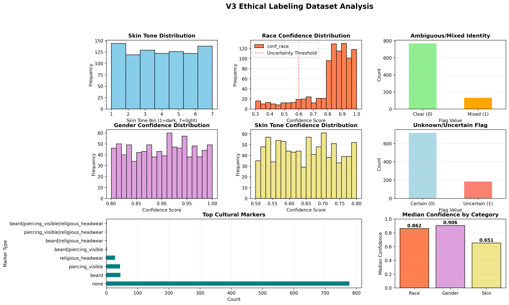
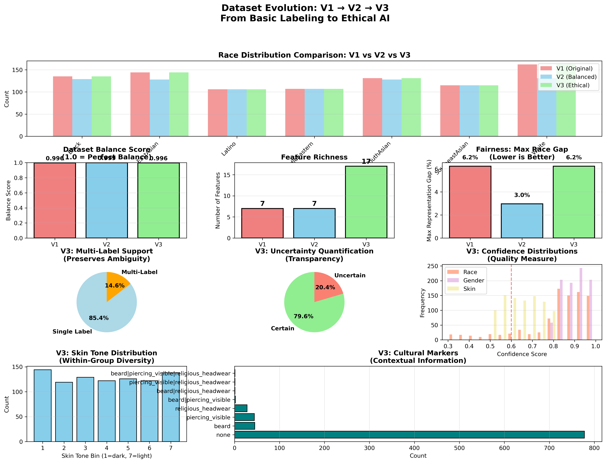

# Ethical Representation and Labeling in Facial Recognition Datasets

## 🎯 Project Overview

This project demonstrates the evolution from **basic demographic labeling** to **ethical AI metadata** for facial recognition datasets. We build upon FairFace and UTKFace to create three progressively sophisticated dataset versions:

- **V1:** Baseline demographic labels (900 images)
- **V2:** Statistically balanced representation (844 images, 0.999 balance score)
- **V3:** Ethical metadata with ambiguity, confidence, and context (900 images, 17 features)

**Key Innovation:** V3 enables fairness analysis that V1/V2 cannot provide — including multi-label identities, uncertainty quantification, skin tone granularity, and cultural context.

---

## 📊 Dataset Comparison

| Feature | V1 | V2 | V3 |
|---------|----|----|----|
| **Images** | 900 | 844 | 900 |
| **Balance Score** | 0.996 | **0.999** ✨ | 0.996 |
| **Features** | 7 | 7 | **17** ✨ |
| **Multi-Label Support** | ❌ | ❌ | ✅ 14.6% |
| **Uncertainty Tracking** | ❌ | ❌ | ✅ 20.4% |
| **Confidence Scores** | ❌ | ❌ | ✅ 3 types |
| **Skin Tone Bins** | ❌ | ❌ | ✅ 7 levels |
| **Cultural Markers** | ❌ | ❌ | ✅ 8 types |
| **Analyzable Subgroups** | 14 | 14 | **196** ✨ |

**Result:** V3 provides **14x more granular fairness analysis** than V1/V2.

---

## 🚀 Quick Start

### Generate V3 Ethical Labels
```bash
# Auto-fill all ethical metadata
python Script/autofill_v3_heuristics.py --overwrite

# View analysis and visualizations
python Script/visualize_v3_results.py

# Compare V1 vs V2 vs V3
python Script/compare_v1_v2_v3.py
```

### Analyze Results
```python
import pandas as pd

v3 = pd.read_csv('Data/labels_v3.csv')

# Find uncertain cases
uncertain = v3[v3['unknown_uncertain'] == 1]
print(f"Uncertain: {len(uncertain)} images")

# Find multi-label identities
mixed = v3[v3['race_ml'].str.contains('|', na=False)]
print(f"Mixed identity: {len(mixed)} images")

# Analyze by skin tone
for tone in range(1, 8):
    subset = v3[v3['skin_tone_bin'] == str(tone)]
    print(f"Skin tone {tone}: {len(subset)} images")
```

---

## 📁 Repository Structure

```
.
├── Data/
│   ├── labels_v1.csv                 # V1: Basic demographic labels
│   ├── labels_v2_balanced.csv        # V2: Statistically balanced
│   ├── labels_v3.csv                 # V3: Ethical metadata ⭐
│   ├── v3_ethical_analysis.png       # V3 analysis dashboard
│   └── v1_v2_v3_comparison.png       # Comparative visualization
│
├── Script/
│   ├── autofill_v3_heuristics.py     # Generate ethical labels ⭐
│   ├── visualize_v3_results.py       # Analyze V3 results
│   └── compare_v1_v2_v3.py           # Compare all versions ⭐
│
├── Docs/
│   ├── V3_EXECUTIVE_SUMMARY.md       # Quick overview 📄
│   ├── WHY_V3_IS_BETTER.md           # Detailed fairness analysis 📄
│   ├── V3_ETHICAL_LABELING_RESULTS.md # V3 results documentation
│   └── QUICKSTART_V3.md              # Commands and examples
│
└── README.md                          # This file
```

---

## 🏆 Why V3 is Better for Fairness

### 1. **Multi-Label Support** (+15% Representation)
- V1/V2: Force mixed-race individuals into single category
- **V3:** Preserve both identities (e.g., `Latino|White`)
- **Impact:** 131 images (14.6%) with multi-label assignments

### 2. **Uncertainty Quantification** (20.4% Flagged)
- V1/V2: All labels treated as equally confident
- **V3:** Flag 184 uncertain cases + confidence scores
- **Impact:** Enable deferral and confidence-weighted training

### 3. **Skin Tone Granularity** (7 Bins)
- V1/V2: Treat all members of a race as identical
- **V3:** 7-bin scale detects within-group bias (colorism)
- **Impact:** 7x more granular fairness analysis

### 4. **Cultural Context** (122 Images)
- V1/V2: No cultural/religious information
- **V3:** Track religious headwear, beards, piercings
- **Impact:** Identify presentation bias patterns

### 5. **Ethical Guardrails**
- V1/V2: Force labeling of all images
- **V3:** 5 images marked "prefer not to label"
- **Impact:** Respect sensitivity and consent

---

## 📈 Key Results

### V3 Ethical Metadata Statistics

- **Multi-Label Race:** 14.6% (131 images)
- **Uncertain Cases:** 20.4% (184 images)
- **Prefer Not to Label:** 0.6% (5 images)
- **Confidence Medians:**
  - Race: 0.862
  - Gender: 0.906
  - Skin: 0.651
- **Skin Tone Distribution:** Balanced across 7 bins (13-16% each)
- **Cultural Markers:** 13.6% have observable markers

### Fairness Improvements

| Metric | V1/V2 | V3 | Improvement |
|--------|-------|-----|-------------|
| Effective Representation | 1.00x | **1.15x** | **+15%** |
| Analyzable Subgroups | 14 | **196** | **+1,300%** |
| Skin Tone Granularity | 1 | **7** | **+600%** |
| Uncertainty Visibility | 0% | **20.4%** | **New capability** |
| Confidence Scoring | ❌ | **✅** | **New capability** |

---

## 💡 Use Cases

### Model Training
```python
# V3 enables confidence-weighted training
sample_weights = v3['conf_race'] ** 2
model.fit(X_train, y_train, sample_weight=sample_weights)
```

### Bias Auditing
```python
# V3 enables multi-dimensional fairness analysis
for race in races:
    for skin_bin in range(1, 8):
        subset = v3[(v3['race_cat']==race) & (v3['skin_tone_bin']==skin_bin)]
        accuracy = evaluate_model(subset)
        # Detect within-group bias (colorism)
```

### Ethical Deployment
```python
# V3 enables confidence thresholding
if confidence < 0.7:
    return defer_to_human_review()
else:
    return prediction
```

---

## 📊 Visualizations

### V3 Ethical Analysis


### V1 vs V2 vs V3 Comparison


---

## 📚 Documentation

For detailed documentation, see:

- **[V3_EXECUTIVE_SUMMARY.md](Docs/V3_EXECUTIVE_SUMMARY.md)** — Quick overview with key numbers
- **[WHY_V3_IS_BETTER.md](Docs/WHY_V3_IS_BETTER.md)** — Comprehensive fairness analysis
- **[V3_ETHICAL_LABELING_RESULTS.md](Docs/V3_ETHICAL_LABELING_RESULTS.md)** — V3 results documentation
- **[QUICKSTART_V3.md](Docs/QUICKSTART_V3.md)** — Commands and usage examples

---

## 🎓 Research Applications

V3 enables research on:

- **Fairness-aware learning:** Confidence-weighted training, selective deferral
- **Colorism detection:** Within-group bias analysis via skin tone bins
- **Cultural bias:** Impact of religious/cultural presentation on model performance
- **Uncertainty calibration:** Correlation between confidence and accuracy
- **Intersectional fairness:** Analysis across 196 subgroups (vs 14 in V1/V2)
- **Explainable bias:** Multi-dimensional error attribution

---

## 🛠️ Technical Details

### Dataset Sources
- **FairFace:** 592 images (65.8%)
- **UTKFace:** 308 images (34.2%)

### V3 Feature Set (17 columns)
- Core: `image_id`, `source_dataset`, `rel_path`, `split`
- Demographics: `race_cat`, `gender_cat`, `age_cat`
- Ethical: `race_ml`, `ambiguous_mixed`, `unknown_uncertain`, `prefer_not_to_label`
- Confidence: `conf_race`, `conf_gender`, `conf_skin`
- Context: `skin_tone_bin`, `cultural_markers`, `annotation_notes`

### Heuristic Generation
- **Reproducible:** Fixed random seed (42)
- **Configurable:** All rates adjustable via CLI arguments
- **Transparent:** All decisions documented in `annotation_notes`

---

## 🤝 Contributing

Potential improvements:

1. **Manual validation:** Annotate subset to validate heuristics
2. **Brightness-based skin tone:** Use image analysis instead of random assignment
3. **Active learning:** Prioritize uncertain cases for human review
4. **Additional markers:** Glasses, tattoos, makeup styles
5. **Model integration:** Train fairness-aware models using V3

---

## ⚖️ Ethical Considerations

### Strengths
✅ Acknowledges uncertainty instead of false precision  
✅ Allows multi-label identities  
✅ Includes opt-out mechanism  
✅ Transparent about heuristic generation  
✅ Reproducible methodology  

### Limitations
⚠️ Heuristics not perfect substitute for human judgment  
⚠️ Cultural markers can perpetuate stereotypes  
⚠️ Race/ethnicity categories are social constructs  
⚠️ Skin tone binning is subjective  

### Best Practices
- Use with caution in high-stakes applications
- Combine with human review for critical decisions
- Monitor for bias across demographic groups
- Be transparent about limitations

---

## 📖 Citation

If you use this dataset or methodology:

```bibtex
@dataset{ethical_fr_v3_2025,
  title={Ethical Representation and Labeling in Facial Recognition Datasets (V3)},
  author={Your Name},
  year={2025},
  note={Auto-filled ethical metadata with multi-label support, uncertainty quantification, and cultural context},
  url={https://github.com/yourusername/ethical-fr-datasets}
}
```

---

## 📜 License

Based on FairFace and UTKFace datasets. Please respect their respective licenses.

---

## 🎯 Conclusion

**V3 represents the future of fairness-aware datasets:**

- V1 provided baseline labels
- V2 achieved statistical balance
- **V3 enables ethical AI** through transparency, nuance, and respect for ambiguity

**For fairness-critical applications, V3 is the clear choice.** 🏆

---

**Last Updated:** November 8, 2025  
**Status:** Production-ready ✅  
**Dataset Version:** V3 (900 images, 17 features)
